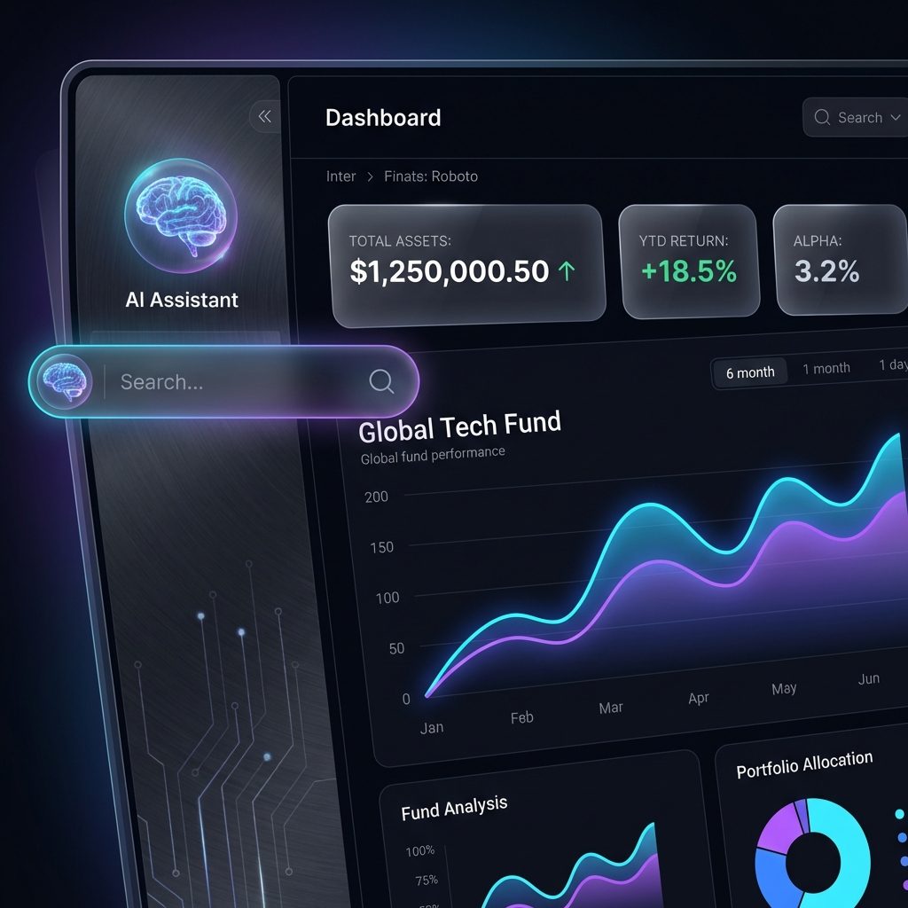
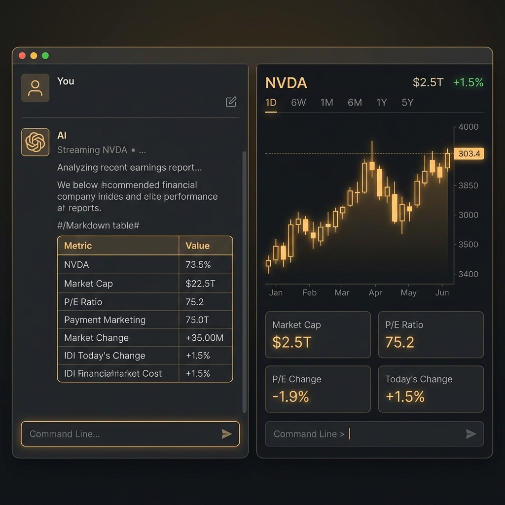
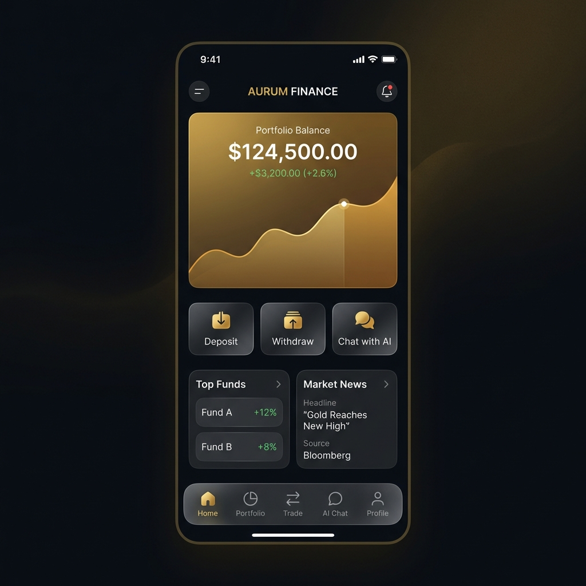
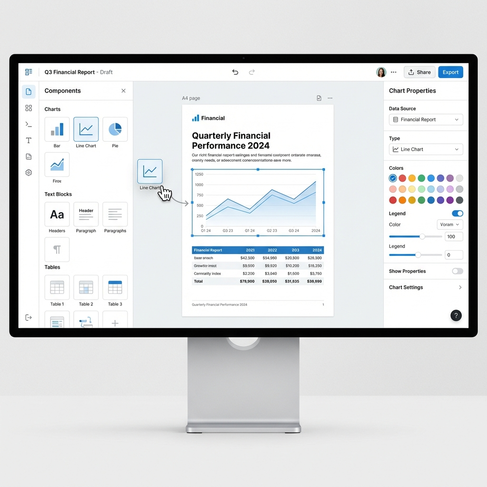

# Mellivora Mind Studio - UI Design Concept

## 1. 设计理念

我们致力于打造一个 **"AI Native"** 的金融投研工作台。界面不仅要展示数据，更要促进"人机协作"。

*   **Keywords**: Premium (高端), Insightful (洞察), Fluid (流畅)
*   **Theme**: Dark Mode (深色模式) 为主，体现金融专业性与沉浸感。

## 2. 概念图预览

### 2.1 C 端 Dashboard (Investor Portal)

以数据可视化为核心，AI 助手随时待命。

*   **玻璃拟态 (Glassmorphism)**：卡片采用半透明磨砂质感，营造层次感。
*   **霓虹渐变 (Neon Gradients)**：图表使用青/紫渐变，极具科技感，同时保证数据清晰度。
*   **全局 AI 入口**：左侧或顶部常驻 AI 助手入口，引导用户通过对话获取信息。

### 2.2 AI 投研助手 (Research Assistant)

"Chat with Data" 的分屏协作模式。

*   **分屏布局 (Split Screen)**：
    *   **左侧 (Chat)**：与 Agent 的对话流，支持 Markdown 表格、公式渲染。
    *   **右侧 (Context Panel)**：根据对话内容自动弹出的"详情页"。例如问到 "NVDA 财报"，右侧自动展示 NVDA 的 K 线图和关键指标。
*   **琥珀色点缀 (Amber Accents)**：呼应品牌色，用于高亮 AI 的洞察摘要。

### 2.3 C 端移动 App (Mobile App)

LP 随时随地查看资产，保持一贯的高端暗色风格。

*   **沉浸式体验**：隐藏不必要的 Chrome，聚焦核心资产数据。
*   **金色/琥珀色点缀**：除了品牌识别度，也传达"财富"与"尊贵"的心理暗示。
*   **便捷交互**：底部导航栏采用 Glassmorphism，操作触手可及。

### 2.4 管理后台 - 智能报告编辑器 (Report Builder)

专业、高效的所见即所得 (WYSIWYG) 编辑环境。

*   **浅色模式 (Light Mode)**：为了模拟打印和阅读效果，编辑器默认采用浅色背景，减少视觉干扰，确保所见即所得。
*   **三栏布局**：
    *   **左侧 (组件库)**：丰富的图表、文本、数据表格组件，支持拖拽上屏。
    *   **中间 (画板)**：A4 纸张比例的编辑区域，支持网格吸附。
    *   **右侧 (属性面板)**：深度定制选中组件的样式和数据源。

## 3. 实现规划 (Frontend)

### C 端 Web (SolidJS + Tailwind)
*   **配色系统**: 自定义 Tailwind用于定义 `bg-midnight`, `text-tech-blue`, `border-glass` 等语义化 Token。
*   **组件库**:虽然主要手写样式以追求极致效果，但会复用 headless UI 组件库（如 Kobalte）来处理无障碍和交互逻辑。
*   **图表库**: ECharts 或 Solid-Charts。

### 管理后台 (React + shadcn/ui)
*   保持 shadcn/ui 默认的 **Slate** 风格，专业、克制、高效。
*   重点在于 **Report Builder** 的交互体验（拖拽布局），计划使用 `dnd-kit` 或 `react-dnd`。
*   编辑器界面将采用浅色主题，确保与最终 PDF 输出效果一致。

